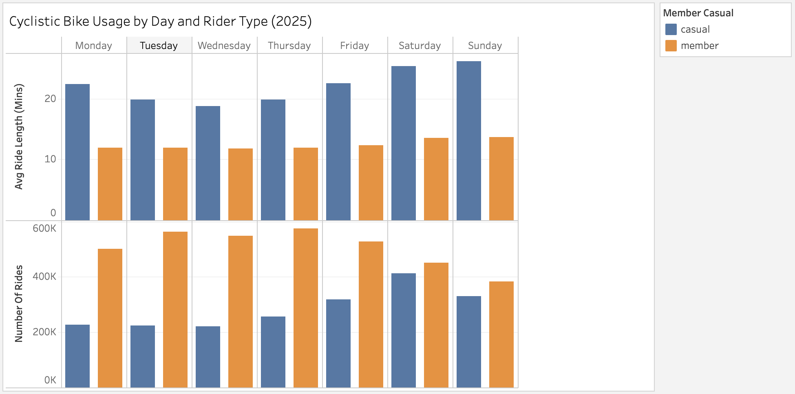

# Cyclistic Bike Share Case Study

## Overview
This project analyzes bike-share usage patterns to understand how casual riders and annual members use Cyclistic bikes differently. The goal is to identify insights that can help convert casual riders into annual members.

## Business Task
Analyze how casual riders and members use Cyclistic bikes differently to inform marketing strategies.

## Dataset
- 12 months of trip data (Jan–Dec 2025)
- Source: Divvy (Motivate International Inc.)
- Data includes ride timestamps, user type, and trip details

## Tools Used
- Python (Pandas)
- Jupyter Notebook
- Data cleaning and aggregation

## Data Cleaning & Processing
- Combined 12 monthly CSV files into one dataset
- Converted date columns to datetime format
- Calculated ride length
- Removed invalid (zero or negative) rides
- Created day-of-week column for analysis

## Key Findings
- Casual riders take longer rides than members
- Casual riders primarily ride on weekends
- Members ride consistently throughout the week, especially weekdays

## Visualization

## Recommendations
- Offer weekend-focused membership promotions
- Highlight cost savings for frequent riders
- Target ads during peak casual usage times (weekends)

## Files in This Repository
- `CaseStudy1_BikeShare.pdf` – Full written case study
- `notebooks/cyclistic_analysis.ipynb` – Data cleaning and analysis code
- `data/summary.csv` – Aggregated results
- `figures/bike_usage_by_day.png` – Visualization

## How to Reproduce
1. Download the dataset from Divvy
2. Open the notebook
3. Run all cells to reproduce analysis
